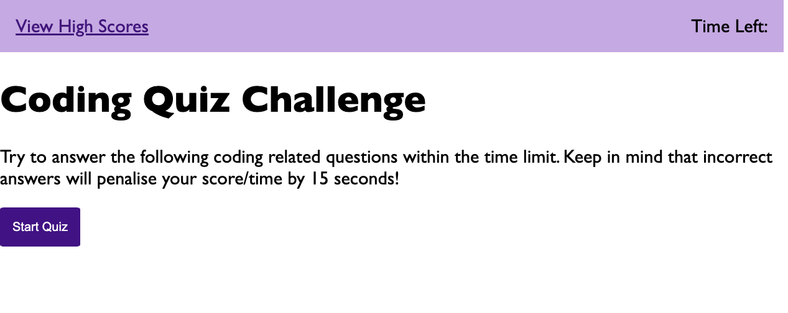
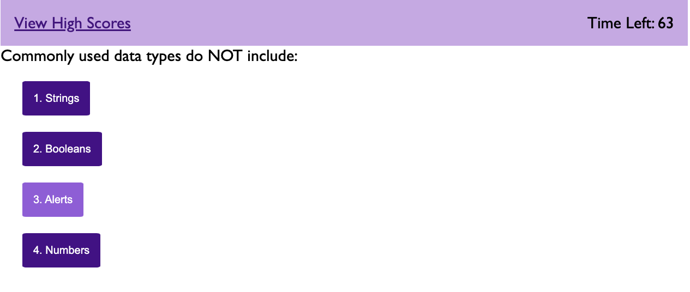
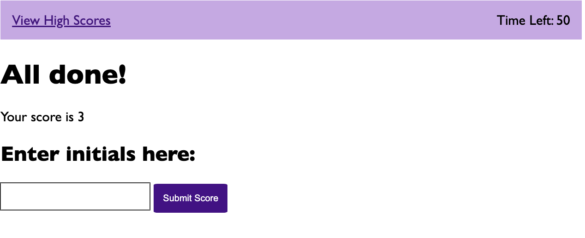

# js_multiple_choice_quiz

## Fucntionality
This is a basic multiple choie quiz which stores High scores in the local storage
* presented with 5 questions to click through
* buttons have hover functionality to signify click areas
* input area to enter initials and high score at the end of question section

## Further development needed
* High scores area correctly displays list
* Timer successfully decrements with wrong answer
* User is immediately notified of answer
* stop timer at end of questions